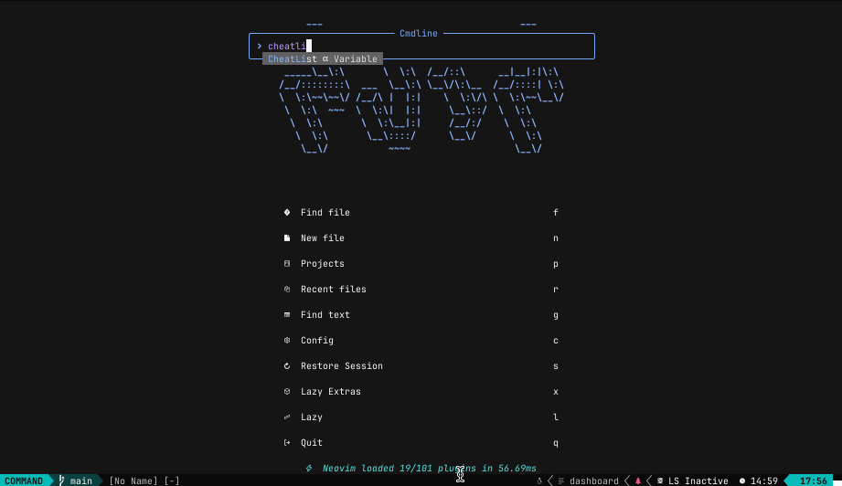

# nvim-cheatsh

`nvim-cheatsh` is a Neovim plugin that integrates with [cheat.sh](https://github.com/chubin/cheat.sh), offering quick access to cheat sheets and documentation for various programming languages, frameworks, and tools directly within your Neovim environment. This plugin utilizes Telescope.nvim to provide an interactive search interface for finding and viewing cheat sheets.

## Screenshots

### Cheat Command


### CheatList Command



## Features

- **Seamless Integration with Telescope**: Leverage Telescope's powerful search capabilities to find cheat sheets.
- **Customizable Display Options**: Configure the display position and size of the cheat sheet window according to your preferences.

## Dependencies

- [Telescope.nvim](https://github.com/nvim-telescope/telescope.nvim)

## Installation

You can install `nvim-cheatsh` using your favorite package manager along with its dependency.

### Using [packer.nvim](https://github.com/wbthomason/packer.nvim)

```lua
use {
  'siawkz/nvim-cheatsh',
  requires = { {'nvim-telescope/telescope.nvim'} }
}
```

### Using vim-plug

```lua
Plug 'nvim-telescope/telescope.nvim'
Plug 'siawkz/nvim-cheatsh'
```

### Using [lazy.nvim](https://github.com/folke/lazy.nvim)

```lua
{
  'siawkz/nvim-cheatsh',
  dependencies = {
    "nvim-telescope/telescope.nvim",
  },
  opts = {
   -- your configuration comes here
   -- or leave it empty to use the default settings
   -- refer to the configuration section below
  },
}
```

## Configuration

### Setup

nvim-cheatsh comes with a default configuration as shown below:

```lua
{
  cheatsh_url = "https://cht.sh/", -- URL of the cheat.sh instance to use, support self-hosted instances
  position = "bottom", -- position of the window can be: bottom, top, left, right
  height = 20, -- height of the cheat when position is top or bottom
  width = 100, -- width of the cheat when position is left or right
}
```

## Usage

After installation and configuration, you can use nvim-cheatsh with the following commands:

```
:Cheat <query>: Search for a cheat sheet and open a cheat sheet window.
:CheatClose: Close the currently open cheat sheet window.
:CheatList: List available cheat sheets in a Telescope picker.
```

#### Query Format

When you enter a query, it's possible to specify the programming language and the topic you're interested in. For example, to search for the C++ RAII principle, you would use:

```sh
:Cheat cpp what is RAII
```

This query gets converted to cpp/what+is+RAII and passed to cheat.sh, fetching the relevant cheat sheet.

## Contributing

Contributions are welcome! If you have any feature requests, bug reports, or suggestions, feel free to open an issue or submit a pull request.

## License

This project is licensed under the MIT License - see the [LICENSE](LICENSE) file for details.
